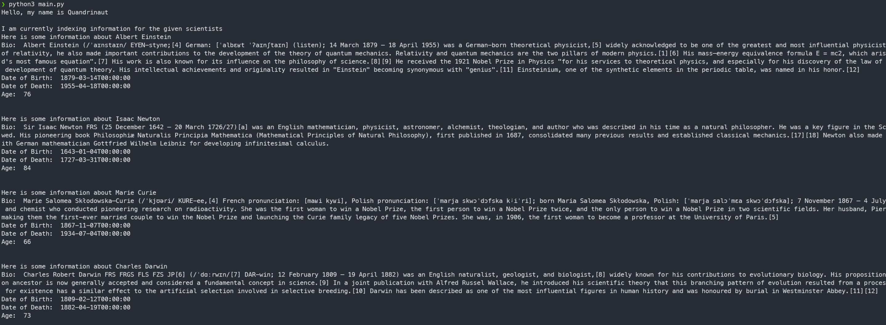
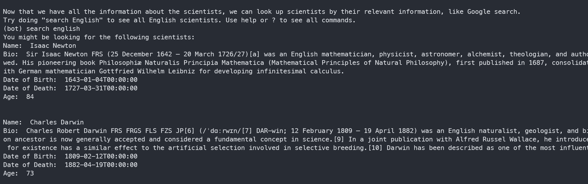
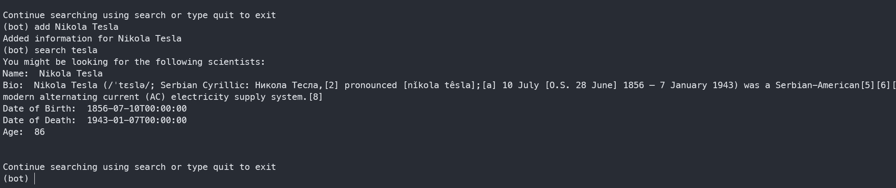

# Quandri Technical Assignment - Siddharth Bhattacharjee
Hello, this is my submission for the Quandri Technical Assignment. The solution in this repo 
completes all the steps (1 through 4) listed in the original prompt. Additionally, it uses an Elasticsearch instance to run reverse-indexed search queries on the scientist information scraped from Wikipedia. It also allows the user to add the information for additional scientists. `simple_test.py` is used to test the happy paths.

### Screenshots: 
The Robot indexes scientist information for scientists provided in the `SCIENTISTS` list and prints it out in human readable format.

The Robot can also search for scientist based on query text and add information for a new scientist: 

## Usage
Please ensure that you have at least 4GB of memory allocated for docker containers. Also, please ensure that a command-line executable for a browser exists on the system. (I used `google-chrome-stable`)

1. Start by running `docker compose up -d elasticsearch`. This will instantiate the local elasticsearch deployment and takes around 30 seconds to be healthy. 
2. Create a virtual environment with `python3 -m venv quandri-robot-venv-sb`. Then run `pip install -r requirements.txt` to install the dependencies in this virtual environment. 
3. Run `webdriver chrome` (assuming the chrome executable exists on the machine) to allow Selenium to use this browser. This should work for other browsers as well (for example, `webdriver firefox`) as long as the executable lives on the machine. 
4. Run the application with `python3 main.py`! 
5. The application will accept input commands to search for and add scientist information
    1. `search <query>` can be used to lookup scientists based on information about the scientist 
    2. `add <scientist name>` can be used to add information to about a new scientist
    3. `quit` is used to exit the application
6. Use `docker compose down` to stop the elasticsearch container.

Instead of running step 4 with `python3 main.py`, `pytest` can be run to test the happy paths of the robot.

## Improvements
1. Multi-threading: I attempted to parallelize the indexing of multiple scientist Wikipedia pages but opted to leave it out to avoid over-engineering the project and prevent the code from being too difficult to read (not worth the perfomance gain). Also, each thread needed a new browser instance which was too much for my machine to handle! 
2. Data Layer Abstraction: The Robot class is closely coupled with Elasticsearch data store. Ideally, I would have liked to abstract the data processing into its own layer and have it plugged into the Robot class. 
3. Dockerize the Application: I was close to getting the Python app fully dockerized so that it would be easy to test. However, I ran into to stdin issues when trying to accept user input and decided to investigate this in the future. 

Thank you! 